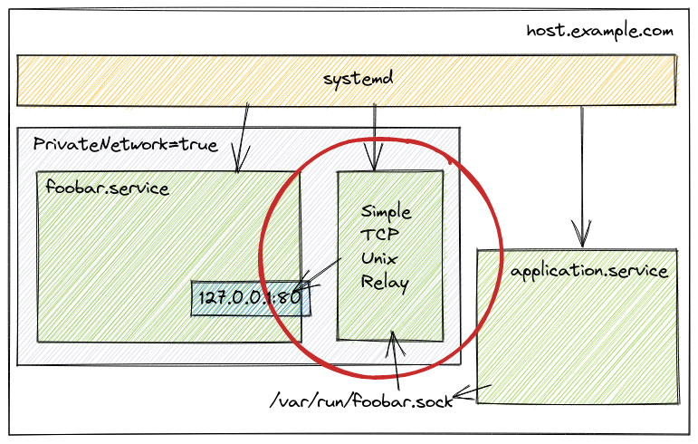

Simple TCP <-> Unix Relay
=========================

`simpletcpunixrelay` is a program which exposes a TCP endpoint as a Unix socket
and vice versa.

Usecase
-------

Let's say you are running your [systemd] services securely, and use
[`PrivateNetwork=yes`] in your unit configuration. If you want other programs
to connect and interact with your service, you best bet is to listen onto an
Unix socket. This works well for program that supports it, [PostgreSQL] is an
example.

However, some programs do not support listening and/or accepting connections
over a UNIX socket. `simpletcpunixrelay` converts a TCP only program into a
program which accepts connections over a UNIX socket.

**WARNING**: If you're looking for a program to securely relay a Unix socket
over the internet, *do NOT* use `simpletcpunixrelay`, as it *does NOT* provide
any encryption. For this use case, we recommend [`spiped`], and recommend
against `simpletcpunixrelay`.

Why not X?
----------

There are multiple programs which could achieve the same result, but they are
not the best tool for the job.

### `socat`

One can use `socat` to relay from a Unix socket towards a TCP socket, and
vice-versa.

However `socat` forks a new process for each connection, which leads to the
[C10k problem].

### `spiped`

[`spiped`] is a recommended alternative for exposing a Unix socket over the
internet. It is not impacted by the [C10k problem].

However, it adds a layer of encryption, which impacts performance, and is
unnecessary overhead for loopback traffic.

Configuration example
---------------------

Use [`PrivateNetwork=yes`] for your service:

    # /etc/systemd/system/foobar.service
    [Unit]
    Description=Foobar server

    [Service]
    User=foobar
    Group=foobar

    ExecStart=/usr/local/bin/foobard --address=127.0.0.1:8000

    PrivateNetwork=yes
    ProtectSystem=full
    ProtectHome=yes
    ProtectProc=invisible

    [Install]
    WantedBy=network.target

Then create a service to relay `foobar.service` to a Unix socket. You need to
use `JoinsNamespaceOf=` in order to run in the same network namespace.

    # /etc/systemd/system/foobar-unix.service
    [Unit]
    Description=Foobar unix socket
    JoinsNamespaceOf=foobar.service
    Requires=foobar.service

    [Service]
    User=foobar
    Group=foobar

    ExecStart=/usr/local/bin/simpletcpunixrelay ${RUNTIME_DIRECTORY}/socket 127.0.0.1:8000

    RuntimeDirectory=foobar-unix
    PrivateNetwork=yes
    ProtectSystem=full
    ProtectHome=yes
    ProtectProc=invisible

You can also run it as a different user and/or group than foobar, in order to
limit who can connect to it.

**Optionally**, if your service needs to be exposed as TCP. For example, in the
case of [minio], its client library doesn't support connecting over Unix
socket. You can re-expose the service externally. For permission reasons, you
need to run it as the same user as `foobar-unix.service`.

    # /etc/systemd/system/foobar-external.service
    [Unit]
    Description=Foobar exposed to other programs
    Requires=foobar-unix.service

    [Service]
    User=foobar
    Group=foobar

    ExecStart=/usr/local/bin/simpletcpunixrelay 127.0.0.1:8000 /var/run/foobar-unix/socket

Mirrors
-------

This repository is mirrored to avoid single points of failure.

Mirrors:

  * http://github.com/acatton/smallunixtcprelay
  * http://gitlab.com/acatton/smallunixtcprelay
  * http://codeberg.org/acatton/smallunixtcprelay

[`PrivateNetwork=yes`]: https://www.freedesktop.org/software/systemd/man/systemd.exec.html#PrivateNetwork=
[systemd]: https://systemd.io
[PostgreSQL]: https://www.postgresql.org/
[`spiped`]: http://www.tarsnap.com/spiped.html
[minio]: https://min.io
[C10k problem]: https://en.wikipedia.org/wiki/C10k_problem
